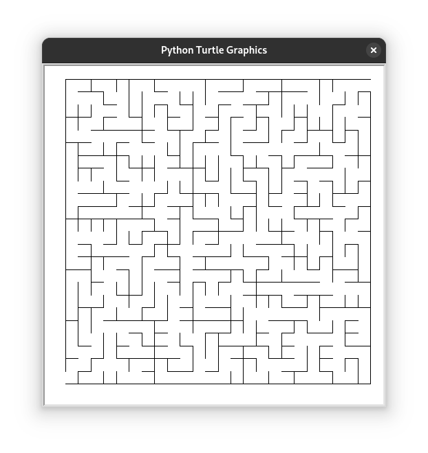

+++
title = 'Outsourcing Muse'
date = 2025-02-20T17:38:01-07:00
draft = true
+++

* I spend a lot of time thinking about solutions to problems

In the true spirit of computer science, I spend a lot of time thinking about problems and solutions. Most of the time, I'm just stumped. Unfortunately, I was never really a programming prodigy. I didn't start programming when I was 5. I've never "dreamt in code". In most science, engineering, and math contexts, I'm slower than my peers.

I've learned not to let these facts bother me. After all, if you've solved every problem you've ever tried to solve, maybe you should be working on harder problems. Time is the only fundamental scarcity. The general consensus appears to be that the scarcity of time is good reason to be paranoid about how you spend your time, fending off FOMO. I assert the opposite: The simple act of _spending time_ is just as important and expressive as what you might do _during that time_.

For a long period of time about a decade ago, I considered how to generate mazes of any size programmatically. I remember thinking about possible solutions for days. I tried a couple ideas in Java and never quite got the results I wanted. This problem haunted me... until I simply moved on. It bested me.

* AI makes the process a lot easier

* easier != better
    * AI frequently gives wrong answers
    * Using AI as a crutch is parasocial
    * Many laws regarding AI training data sets, copyright, and privacy are yet to be written
        * https://haveibeentrained.com/
        * If my personal information lands in a training dataset, how do I get it redacted?
    * AI training and usage contributes to carbon emissions
* We can all solve problems

A decade after musing about maze generation algorithms, I finally implemented one in Python. [The code](maze.py) isn't pretty, but it was written entirely by me, in an effort to answer a question I had.

