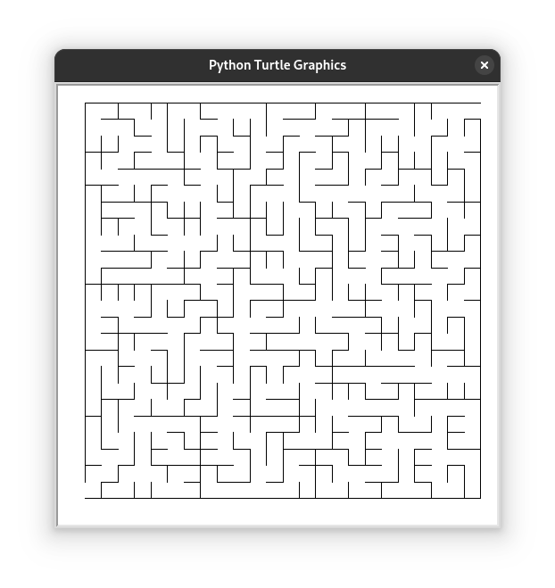

+++
title = 'On AI and Code: Outsourcing Muse'
date = 2025-02-20T17:38:01-07:00
draft = true
+++

In the true spirit of computer science, I spend a lot of time thinking about problems and solutions. Most of the time, I'm just stumped. Unfortunately, I was never really a programming prodigy. I didn't start programming when I was 5. I've never "dreamt in code". In most science, engineering, and math contexts, I'm slower than my peers.

I've learned not to let these facts bother me. After all, if you've solved every problem you've ever tried to solve, maybe you should be working on harder problems. Time is the only fundamental scarcity. General consensus says the fact that time is scarce is good reason to be paranoid about how you spend your time. I assert the opposite: The simple act of _spending time_ is just as important and expressive as what you might do _during that time_.

For a long period of time about a decade ago, I considered how to generate mazes of any size programmatically. I remember thinking about possible solutions for days. I tried a couple ideas in Java and never quite got the results I wanted. This problem haunted me... until I simply moved on. It bested me.

## (In)efficiency

I wonder, if I had the same programming ability now as I did then, could AI help me come closer to a solution? The resounding answer from OpenAI, Google, GitHub, Facebook, Nvidia, Elon Musk and friends is, "Yes! AI can help you code more efficiently! Our digital assistant can make you 137% more efficient![^1]" It's only natural that they would want the rest of us to be excited about AI, considering their stake in the technology.

Let's assume that AI _can_, in fact, help me write code of a higher quality and in less time than I could alone. Completeness and quality are always good. Efficiency sounds nice, but is it really all that important? After all, not all those who wander are lost. Even if AI lives up to the futuristic promises, is it worth the cost?

AI is often criticized for frequently giving wrong answers. In my own experience, this is absolutely true, but can we really blame it for that? After all, I've heard professors, co-workers, and peers make deeply incorrect claims in the same authoritative voice that AI perpetually writes in. Maybe it's especially frustrating when AI does it because we expect cold, hard computers to be precise and exact, but there are more convincing arguments against using AI:

* **AI training datasets are unregulated by legislature**

    * https://haveibeentrained.com/
    * If my personal information lands in a training dataset, how do I get it redacted?
* **AI training and usage contributes to carbon emissions**

    The process of training an AI takes a huge amount of computational power. In order to produce their latest model, Grok v3, xAI constructed a supercomputer in Memphis. Ever since the data center's electrical consumption surpassed the limits of the Memphis power grid, xAI has been using methane gas turbines to fuel their supercomputer. https://www.southernenvironment.org/news/elon-musks-xai-facility-is-polluting-south-memphis/

* **Botnets which search for training material are DDoSing the internet**
* **Using only AI to answer questions is antisocial**

## _Real_ Intelligence

Unlike the bots', our intelligence isn't artificial. We're perfectly capable of finding answers to our own questions and reaching out to each other when we need help. I'm going to try to seek out my own experience and information more, instead of relying on AI.

A decade after puzzling over maze generation algorithms, I finally implemented one in Python[^2]. [The code](maze.py) isn't pretty, but I had fun writing it! It was written entirely by myself, in an effort to answer a question I had.

[^1]: Motion, a digital secretary, made this claim when I accessed their homepage February 20, 2025. Your guess as to how their marketing team came up with 137% is as good as mine...

[^2]: Yeah, I wrote this script without the help of AI mainly to prove my point, but I also happened to have fun while I was doing it. :man_shrugging:

